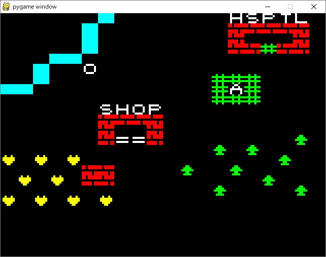

# CGGPYG
the 8bit-like character displaying library with pygame

## what is CGGPYG?
to draw oldPC-like text characters, graphic characters and text strings like below:

## use for
create game without image files, add scoring display in your own game easily.

## depends on

python2, pygame

## initialize in python script

from syslogic.CGGPYG import *

in the head of your program and create object

cgg=CGGPYG()

## methods

def putc(chrname,x,y)

put character in 20*20 screen.

def setcolor()

set character's color

1:black 2:blue 3;magenta 4:green 5:cyan 6:yellow 7 or other:white

def cls()

clear screen

def printc(str,x,y)

print character strings
